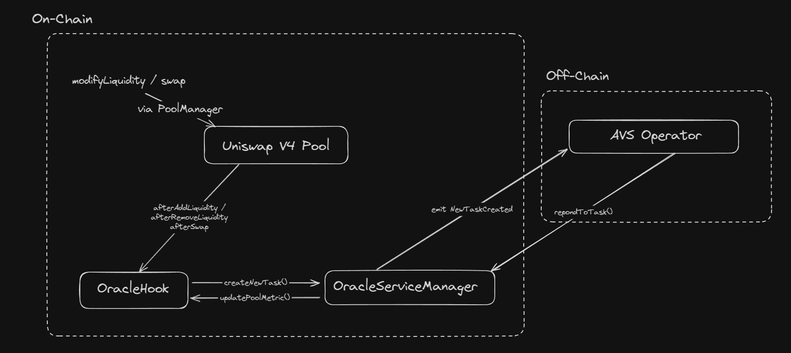

# Liquidity Oracle

## Table of Contents

- [Demo](#demo)
- [Overview](#overview)
- [Core Functionality](#core-functionality)
- [Architecture](#architecture)
- [Key Metrics](#key-metrics)
- [Setup](#setup)
- [Applications](#applications)
- [Extensions & Future Roadmap](#extensions--future-roadmap)
- [License](#license)

## Demo

## Overview

The **Liquidity Oracle** is a decentralized analytics system designed to monitor and quantify liquidity behavior in **Uniswap v4 pools**. By leveraging **EigenLayer's AVS infrastructure**, it provides real-time metrics and insights into pool dynamics, helping liquidity providers, market makers, and risk managers make data-driven decisions.

## Core Functionality

The oracle tracks two primary categories of data:

### **Static Liquidity Metrics**

- **Spread** – Measures the difference between bid and ask prices, which reflects market liquidity and trading costs. A tighter spread indicates better liquidity. Measured using the **standard deviation of weighted ticks**. [Read more](https://en.wikipedia.org/wiki/Bid%E2%80%93ask_spread)
- **Depth** – Represents the amount of liquidity available at different price levels. It helps estimate how large orders impact the market price. Measured using the **weighted mean of liquidities**. [Read more](https://en.wikipedia.org/wiki/Market_depth)
- **Liquidity Concentration** – Determines how evenly liquidity is distributed across price levels. Measured using the **Herfindahl-Hirschman Index (HHI)**, which quantifies concentration. A higher HHI suggests liquidity is concentrated at fewer price points. [Read more](https://en.wikipedia.org/wiki/Herfindahl_index)

### **Dynamic Parameters**

- **Liquidity Transition** – Tracks how liquidity shifts across ticks over time. This metric uses **Cosine Similarity** (measuring directional similarity of liquidity vectors), **Wasserstein Distance** (assessing the effort needed to redistribute liquidity), and **Hellinger Distance** (quantifying differences in probability distributions).
  - [Cosine Similarity](https://en.wikipedia.org/wiki/Cosine_similarity)
  - [Wasserstein Distance](https://en.wikipedia.org/wiki/Wasserstein_metric)
  - [Hellinger Distance](https://en.wikipedia.org/wiki/Hellinger_distance)
- **Time-Based Volatility** – Measures fluctuations in liquidity over time. This is assessed using:
  - **Time-Based Transition** – Captures liquidity shifts within a given time frame.
  - **Entropy** – Quantifies the randomness in liquidity changes. [Read more](<https://en.wikipedia.org/wiki/Entropy_(information_theory)>)
  - **Temporal Volatility** – Measures variations in liquidity values over time.
  - **Per-Tick Volatility** – Smoothed using an **Exponential Weighted Moving Average (EWMA)** to give more importance to recent changes. [Read more](https://en.wikipedia.org/wiki/Moving_average#Exponential_moving_average)

## Architecture

The system employs a hybrid **on-chain** and **off-chain** approach:

### **1. Oracle Hook**

A **Uniswap v4 Hook** responsible for maintaining pool metrics and triggering AVS computations based on predefined conditions:

- **Liquidity Delta** – Detects significant changes in liquidity.
- **Time Delta** – Ensures periodic updates.
- **Price (Tick) Delta** – Monitors price movement across ticks.

### **2. Oracle Service Manager**

- Manages task creation for AVS computations.
- Validates AVS operator responses before posting them to the Oracle Hook.
- Integrates with **EigenLayer core contracts**.

### **3. AVS Operator**

- Analyzes liquidity distribution curves.
- Computes volatility and transition metrics.
- Calculates structural liquidity parameters.
- Signs and submits results on-chain.



## Key Metrics

The Liquidity Oracle quantifies pool liquidity behavior through several key indicators:

### **1. Spread Analysis**

- **Effective bid-ask spreads** – The smaller the spread, the lower the transaction cost.
- **Liquidity density distribution** – Examines how liquidity is spread across different price levels.
- **Price impact curves** – Assesses how price changes with different order sizes.

### **2. Depth Measurements**

- **Available liquidity at price levels** – Measures how much liquidity is available at different price points.
- **Slippage projections** – Estimates how much price will shift when a trade is executed.
- **Market impact estimations** – Analyzes how large trades affect market price.

### **3. Liquidity Transition Analysis**

- Tracked using **Cosine Similarity, Wasserstein Distance, and Hellinger Distance**.
- Measures how liquidity shifts across ticks over time.

### **4. Volatility Computation**

- Time-based volatility tracking using:
  - Entropy metrics.
  - Per-tick volatility (EWMA-based smoothing).
  - Temporal volatility assessments.

## Setup

1. **Clone the repository:**

   ```bash
   git clone https://github.com/Suryansh-23/liquidity-oracle
   ```

2. **Start Local Chain (Anvil):**

   ```bash
   make start-anvil
   ```

3. **Start the Operator in a new terminal window:**

   ```bash
   make master
   ```

4. **Test a liquidity modification in another terminal window:**

   ```bash
   make test-modify-liquidity
   ```

5. **Start the simulator:**

   ```bash
   make start-simulator
   ```

6. **Launch the dashboard:**
   ```bash
   make start-dashboard
   ```

## Applications

### Enhanced LP Strategies

- Real-time liquidity rebalancing based on liquidity transitions.
- Optimized position ranges using historical liquidity data.

### Risk Management

- Improved liquidation mechanisms using liquidity depth insights.
- Better volatility forecasting with liquidity transition data.
- Preemptive position adjustments to avoid high-slippage trades.

### Market Analysis

- Deep insights into market maker behavior across time.
- Predictive modeling using oracle-provided liquidity metrics.
- Detection of abnormal liquidity behaviors (e.g., sandwich attacks).

### Automated Liquidity Provisioning

- Dynamic fee adjustments based on volatility and depth analysis.
- Adaptive liquidity allocation across multiple Uniswap pools.
- Integration with automated market makers (AMMs) for optimizing liquidity distribution.

### Liquid Staking & Yield Strategies

- Determining optimal staking vs. LP rewards based on volatility.
- Risk-adjusted allocation of liquidity for better yield optimization.
- Cross-protocol liquidity monitoring for better capital efficiency.

### Flash Loan & Arbitrage Strategy Optimization

- Real-time liquidity transition data to identify profitable arbitrage opportunities.
- Flash loan risk analysis to prevent large slippage in short-term trades.
- Enhanced execution for MEV bots leveraging precise liquidity estimates.

### Lending Protocol Risk Modeling

- Borrow/Lend market risk estimation based on liquidity depth.
- Adaptive collateral ratio adjustments based on market volatility.
- Preventing cascading liquidations by integrating liquidity-aware triggers.

## Extensions & Future Roadmap

### 1. Improved AVS Triggering Mechanism

- Develop a dynamic threshold model for triggering AVS computations per pool.
- Introduce pool-specific sensitivity settings based on historical liquidity behavior.
- Optimize gas efficiency by reducing unnecessary AVS computations.

### 2. Advanced Liquidity Metrics

- Liquidity Fragmentation – Measures how liquidity is distributed across multiple pools or chains.
- Tick Density Gradient – Analyzes liquidity concentration per tick to detect clustering patterns.
- Liquidity Time-To-Live (LTTL) – Estimates the lifespan of liquidity at different price levels.

### 3. Slashing Mechanism for AVS Operators

- Introduce a stake-slashing protocol for AVS operators submitting incorrect or delayed data.
- Implement on-chain fraud detection to penalize misreporting.
- Use historical accuracy tracking to reward reliable operators and slash malicious ones.

### 4. Quorum-Based Signature Aggregation

- Use multi-signature threshold schemes to aggregate operator responses.
- Implement BLS or Schnorr signature aggregation for efficient verification.
- Reduce on-chain storage costs by bundling AVS responses into a single proof.

## License

This project is licensed under [LICENSE](LICENSE).
